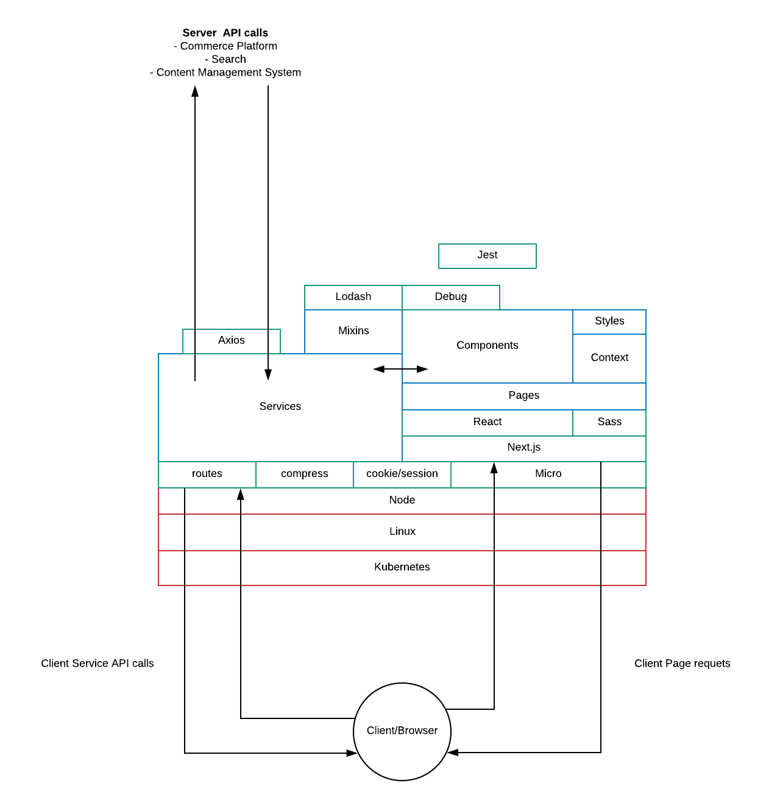

# Web Tier 

## About

This document describes the software stack, architecture for the UX tier (head) and provided step-by-step instructions to set up your local development environment.

## Software Stack

### Logical Architecture


### Software Stack 

| Software | Description                                                                                                                                                           | Current Version | References                          |
|----------|-----------------------------------------------------------------------------------------------------------------------------------------------------------------------|-----------------|-------------------------------------|
| axios    | Promise based HTTP client for the browser and node.js| 0.18.0          | https://www.npmjs.com/package/axios |
| debug    | A tiny JavaScript debugging utility modelled after Node.js core's debugging technique. Works in Node.js and web browsers.                                             | 4.1.0           | https://www.npmjs.com/package/debug |
| esm      | An opt-in, spec-compliant, ECMAScript (ES) module loader that enables a smooth transition between Node and ES module formats. Used to enable ES modules in Node today | 3.0.84          | https://www.npmjs.com/package/esm |
| jest     | jest is a library for testing JavaScript code and it’s especially well suited for React code testing | 23.6.0          | https://jestjs.io/en/ |
| lodash   | JavaScript utility library | 4.17.11          | https://lodash.com/ |
| micro | Module used for writing and invoking microservice in Node.js. Micro is used to create HTTP services using async/await and thinking in microservices. It's a wrapper for the http Node.js native module. | 9.3.3 |https://www.npmjs.com/package/micro <br/> https://mxstbr.blog/2017/01/your-first-node-microservice/|
| micro-compress | Compression for HTTP microservices built with Micro | 1.0.0 | https://www.npmjs.com/package/micro-compress |
| micro-dev | Command line interface provides which provides tools that help in building microservices using micro! It's only meant to be used in development, not in production (that's where micro comes in). | 3.0.0 |https://github.com/zeit/micro-dev |
| micro-route | HTTP routing helper based on url-pattern | 2.5.0 | https://www.npmjs.com/package/micro-route |
| next | Next.js is a minimalistic framework for server-rendered React applications. | 7.0.0 | |
| next-sass | Used to import .sass or .scss files in your Next.js project| 1.0.1 | https://github.com/zeit/next-plugins/blob/master/packages/next-sass/readme.md |
| node | JavaScript runtime engine.| 10.13.0 (Latest Active LTS version) | https://nodejs.org/en/ |
| node-sass | Node-sass is a library that provides binding for Node.js to LibSass, the C version of the popular stylesheet preprocessor, Sass. It allows us to natively compile SCSS files to CSS. | 4.9.4 |https://www.npmjs.com/package/node-sass <br/> http://zetcode.com/javascript/nodesass/ |
| react | A JavaScript library for building user interfaces | 16.6.0 | https://reactjs.org/ |
| react-dom | As the name implies, ReactDOM is the glue between React and the DOM. | 16.6.0 | https://reactjs.org/docs/react-dom.html <br/> https://stackoverflow.com/questions/34114350/react-vs-reactdom |  
  
----  
## Instructions for setting up local environment

### Prerequisites
1. Get admin rights to your machine
2. Get access to the source code management system


### One time setup (Draft)

1. **Install NVM**: We will use NVM to manage the versions of Node.js. Download NVM via curl command and make sure nvm is installed correctly.

  + **MacOS**: Run the following commands in a terminal

     ```
    curl -o- https://raw.githubusercontent.com/creationix/nvm/v0.33.8/install.sh | bash

    nvm --version
    ```
    Reference: [Installing NVM](https://nodesource.com/blog/installing-node-js-tutorial-using-nvm-on-mac-os-x-and-ubuntu/)

  + **Windows**: NVM as known is for Mac/Linux only. For Windows, the idea is to install specific version of Node.js unless you want to try other alternatives.

2. **Install Node**: Install the specific version of Node.js for your project. Set that version as default. Run the following commands in a terminal.correctly.

  + **MacOS**: Run the following commands in a terminal
  
     ```
    nvm install 10.13.0
    nvm use v10.13.0
    nvm alias default v10.13.0
    node --version
    ```

  + **Windows**: Download the Node.js pre-built installer for your platform from  [nodejs.org](https://nodejs.org/en/download/). Select LTS Windows Installer (v10.13.0)
  
 
3. **Checkout Code**:

    ```
    git clone https://github.com/kpath/dmr-web.git
    ```
    __Note for Windows users:__ Run the follwing command to prevent line-ending issues

    ```
    git config --global core.autocrlf false
    ```

4. **Install Dependencies**: Change directory to your project directory where you checked out the code and execute the following commands

    ```
    cd <project-dir>
    npm install
    ```

4. **Domain Setup**
 + **MacOS**: Add the lines on the right to your /etc/hosts file (requires admin privileges).

    ```
    127.0.0.1 dev.dmr.com
    ```
+ **Windows**: Add the above lines to c:\Windows\System32\Drivers\etc\hosts (requires admin privileges)
    
### Running the application
Open terminal window and execute

```
 npm run dev
 ```

### Accessing the site
Access the site using
+ http://dev.dmr.com:3000


